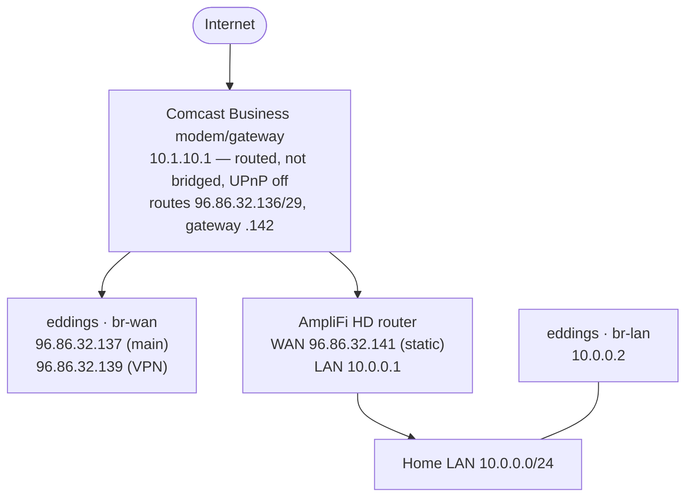
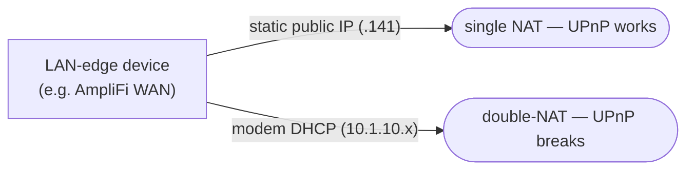

# Eddings Networking Role

Configures `eddings`' host networking via netplan — the WAN and LAN bridges the server uses to
reach the internet and the home LAN.

## Overview

This role installs `files/netplan/00-installer-config.yaml`, which defines two bridges:

- **`br-wan`** (on `eno1`) — the public/WAN side, cabled directly to the Comcast Business modem.
  Holds the server's static public IPs and the default route.
- **`br-lan`** (on `enp4s0`) — the home LAN side, a DHCP client on `10.0.0.0/24`
  (reserved at `10.0.0.2`).

## Home network topology

### ISP / address block
- Provider: **Comcast Business** — routed static block **`96.86.32.136/29`**, gateway
  **`96.86.32.142`**. IPv6 block **`2603:3003:5207:ad00::/56`**.

### Public IP assignments (`96.86.32.136/29`)
| Address | Use |
| --- | --- |
| `.137` | `eddings` — primary public IP |
| `.139` | `eddings` — VPN gateway |
| `.141` | AmpliFi HD WAN / home network edge (`karlanderica`) |
| `.138`, `.140` | spare |
| `.142` | Comcast gateway |

### Cable modem
The Comcast Business gateway (`10.1.10.1`) runs in **routed mode — it is *not* bridged**, and
UPnP is disabled on it. It routes the `/29` to devices that statically configure a public IP from
the block, and hands out private `10.1.10.x` via DHCP to anything else. Two devices are cabled
directly to it: `eddings`' WAN (`br-wan`) and the **AmpliFi HD** router's WAN.

## Operational notes

**LAN-edge devices must use a static public IP from the block.** Because the modem is routed
(not bridged), a device left on modem DHCP lands on a private `10.1.10.x` address = **double-NAT**,
which breaks inbound/UPnP port mapping (this caused a Terraria hosting outage in 2026-08 until the
AmpliFi's WAN was set to the static `96.86.32.141`):

**Do not put the modem in bridge mode.** Bridge mode passes a single public IP to a single device
and stops routing the `/29` to multiple hosts — which would break `eddings`' directly-cabled public
IPs (and everything it serves). The routed-mode + per-device static IP arrangement is intentional.

## Files

- `files/netplan/00-installer-config.yaml` — the netplan applied to `eddings`.
